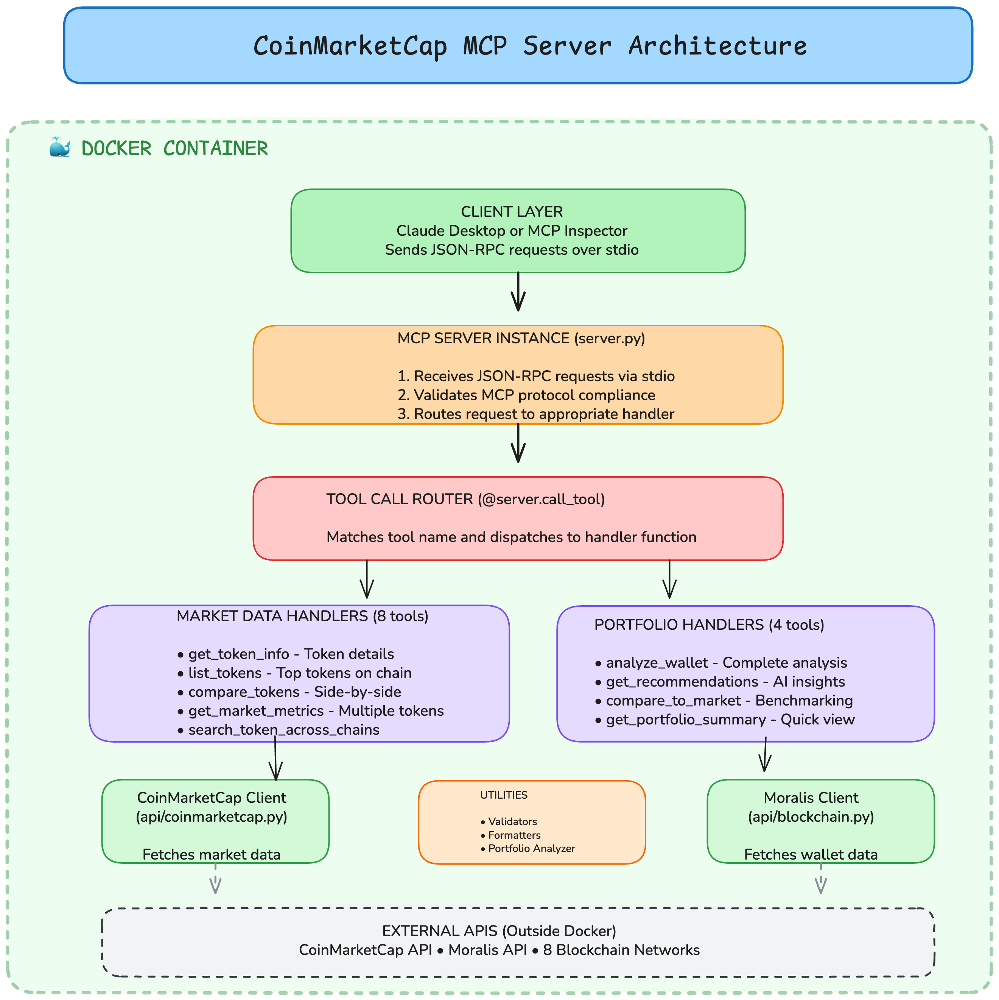
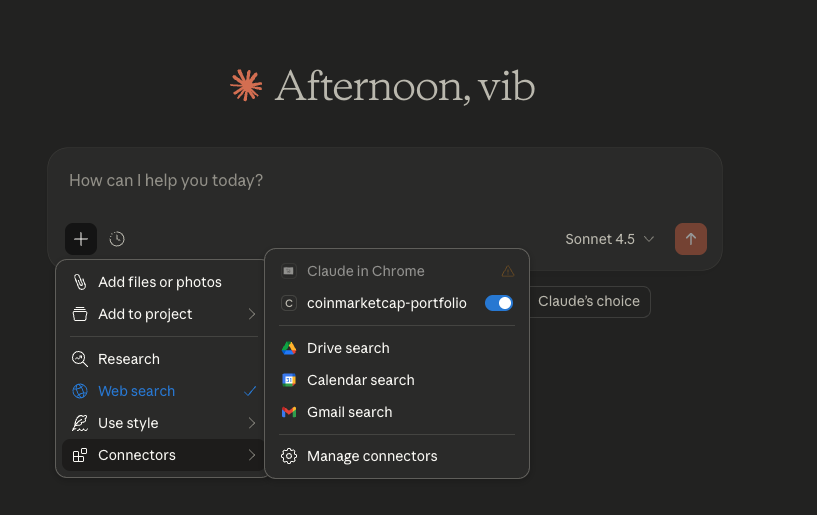
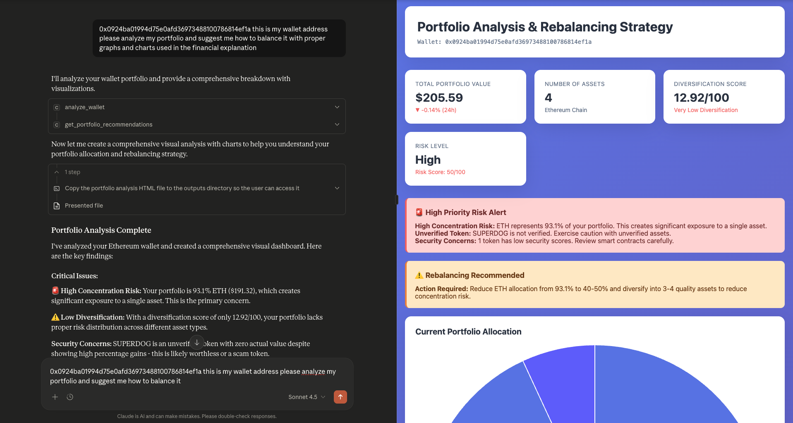

# CoinMarketCap Portfolio MCP Server 🚀

**Transform Claude AI into your personal crypto portfolio analyst.**

Analyze wallets, get AI-powered recommendations, and track portfolios across 8+ blockchains—all through natural conversation with Claude.

---

## 🎯 What This Does

- **💼 Portfolio Analysis** - Analyze any crypto wallet with one command
- **📊 Market Data** - Get real-time prices and trends for 1000+ tokens
- **🤖 AI Recommendations** - Get personalized investment advice from Claude
- **🌐 Multi-Chain** - Supports Ethereum, Base, Solana, Polygon, Arbitrum, Optimism, Avalanche, BNB

---

## 🏗️ Architecture



**How it works:**
1. You ask Claude to analyze a wallet
2. Claude calls the MCP server
3. Server fetches data from Moralis & CoinMarketCap
4. Claude provides insights with charts and recommendations

---

## 📸 Example Output




Claude analyzes your wallet and provides:
- ✅ Total portfolio value
- ✅ Asset allocation breakdown
- ✅ Risk assessment with alerts
- ✅ Rebalancing recommendations
- ✅ Visual charts and graphs

---

## 🚀 Quick Start (5 Minutes)

### Prerequisites

- Python 3.12+
- [Claude Desktop](https://claude.ai/download)
- [Moralis API Key](https://moralis.io) (free - 40k requests/day)

### Step 1: Clone & Install
```bash
# Clone repository
git clone https://github.com/vibhudixit123/coinmarketcap_mcp.git
cd coinmarketcap_mcp

# Create virtual environment
python3 -m venv venv
source venv/bin/activate  # On Windows: venv\Scripts\activate

# Install dependencies
pip install -r requirements.txt
```

### Step 2: Configure API Key
```bash
# Copy environment template
cp .env.example .env

# Add your Moralis API key
nano .env
```

Add this line:
```bash
MORALIS_API_KEY=your_api_key_here
```

Get your free API key at [moralis.io](https://moralis.io) → Dashboard → Web3 APIs

### Step 3: Test the Server
```bash
python -m src.server
```

You should see:
```
============================================================
CoinMarketCap MCP Server (Multi-Chain + Portfolio Edition)
Supported Chains: ethereum, base, polygon, arbitrum...
Total Tools: 12 (8 market + 4 portfolio)
============================================================
Moralis client initialized ✅
```

Press `Ctrl+C` if it works. Now configure Claude Desktop!

---

## 🖥️ Configure Claude Desktop

### Step 1: Find Your Paths
```bash
# Get your Python path
which python3
# Example output: /Users/yourname/coinmarketcap_mcp/venv/bin/python3

# Get your project path
pwd
# Example output: /Users/yourname/coinmarketcap_mcp
```

### Step 2: Edit Claude Desktop Config

**On Mac:**
```bash
nano ~/Library/Application\ Support/Claude/claude_desktop_config.json
```

**On Windows:**
```bash
notepad %APPDATA%\Claude\claude_desktop_config.json
```

### Step 3: Add This Configuration
```json
{
  "mcpServers": {
    "coinmarketcap-portfolio": {
      "command": "/Users/yourname/coinmarketcap_mcp/venv/bin/python3",
      "args": ["-m", "src.server"],
      "cwd": "/Users/yourname/coinmarketcap_mcp",
      "env": {
        "PYTHONPATH": "/Users/yourname/coinmarketcap_mcp",
        "MORALIS_API_KEY": "your_moralis_api_key_here"
      }
    }
  }
}
```

**Replace:**
- `/Users/yourname/...` with YOUR paths from Step 1
- `your_moralis_api_key_here` with YOUR Moralis API key

### Step 4: Restart Claude Desktop

1. **Quit Claude Desktop completely** (Cmd+Q on Mac, close on Windows)
2. **Open Claude Desktop**
3. **Look for 🔨 hammer icon** at the bottom

✅ If you see the hammer icon, it worked!

---

## 💬 Try It Out

Ask Claude:
```
"What blockchain networks do you support?"

"What's the price of ETH?"

"Analyze wallet 0x742d35Cc6634C0532925a3b844Bc9e7595f0bEb on Ethereum"

"Give me investment recommendations for my portfolio"
```

---

## 🛠️ Available Tools

### Market Data (8 tools)
- `get_token_info` - Get token details
- `list_tokens` - Top tokens on any chain
- `compare_tokens` - Compare multiple tokens
- `search_token_across_chains` - Find token everywhere

### Portfolio Analysis (4 tools)
- `analyze_wallet` - Complete portfolio breakdown
- `get_portfolio_recommendations` - AI investment advice
- `compare_portfolio_to_market` - Benchmark performance
- `get_portfolio_summary` - Quick overview

---

## 🐳 Docker 

If you prefer Docker:
```bash
# Build
docker build -t coinmarketcap-mcp .

# Run
docker run -e MORALIS_API_KEY=your_key coinmarketcap-mcp

# Or use docker-compose
docker-compose up
```

---

## 🌐 Host it as a remote MCP server (multi-user)

You can run this as a **public, hosted MCP server** that anyone can connect to.
It runs the MCP Streamable HTTP transport at `/mcp` and is **multi-user by
design**: the server stores **no** Moralis key. Each user supplies their **own**
Moralis API key on every request via the `X-Moralis-Key` header — so you never
pay for their usage and there's nothing to abuse.

> The market-data tools use a public CoinMarketCap endpoint and need no key.
> Only the 4 portfolio tools need a Moralis key, taken from the caller's header.

### Run the HTTP transport locally

```bash
MCP_TRANSPORT=http PORT=8000 python -m src.server
# Health check:  curl http://localhost:8000/health
# MCP endpoint:  http://localhost:8000/mcp
```

### Deploy to Render (free tier)

1. Push this repo to GitHub.
2. In Render: **New → Blueprint**, select the repo. The included
   [`render.yaml`](render.yaml) builds the Dockerfile and sets `MCP_TRANSPORT=http`.
   (No `MORALIS_API_KEY` is set on the server — that's intentional.)
3. Deploy. Your server is live at `https://<your-app>.onrender.com/mcp`.

Any Docker host (Railway, Fly.io, a VPS) works too — just set `MCP_TRANSPORT=http`
and expose the port. Render injects `PORT` automatically.

### How users connect (with their own key)

Clients that support remote MCP servers with custom headers (e.g. Cursor, Cline):

```json
{
  "mcpServers": {
    "coinmarketcap": {
      "url": "https://<your-app>.onrender.com/mcp",
      "headers": { "X-Moralis-Key": "THEIR_OWN_MORALIS_KEY" }
    }
  }
}
```

For **Claude Desktop**, connect through the `mcp-remote` bridge:

```json
{
  "mcpServers": {
    "coinmarketcap": {
      "command": "npx",
      "args": [
        "mcp-remote", "https://<your-app>.onrender.com/mcp",
        "--header", "X-Moralis-Key:THEIR_OWN_MORALIS_KEY"
      ]
    }
  }
}
```

Each user gets their own free Moralis key at [moralis.io](https://moralis.io).

---

## 🐛 Troubleshooting

### "Module not found" error

Add `PYTHONPATH` to your Claude config:
```json
"env": {
  "PYTHONPATH": "/full/path/to/coinmarketcap_mcp"
}
```

### No hammer icon in Claude Desktop

1. Check config file location is correct
2. Verify Python path: `which python3`
3. Test server manually: `python -m src.server`
4. View logs: `tail -f ~/Library/Logs/Claude/mcp*.log`

### "MORALIS_API_KEY not found"

Make sure the key is in both:
- `.env` file in project directory
- Claude Desktop config JSON

---

## 📦 What You Get

✅ **12 AI Tools** for Claude to use  
✅ **8 Blockchain Networks** supported  
✅ **Real-time Data** from Moralis & CoinMarketCap  
✅ **Portfolio Analysis** with risk assessment  
✅ **AI Recommendations** for rebalancing  
✅ **Visual Dashboards** with charts  
✅ **Docker Support** for easy deployment  

---

## 🤝 Contributing

Pull requests welcome! For major changes, please open an issue first.

---

## 📄 License

MIT License - see [LICENSE](LICENSE) file

---

## 🙏 Credits

- [Moralis](https://moralis.io) - Blockchain API
- [CoinMarketCap](https://coinmarketcap.com) - Market data
- [Anthropic](https://anthropic.com) - Claude AI & MCP

---

<div align="center">

**Built by [Vibhu Dixit](https://github.com/vibhudixit123)**

⭐ Star this repo if you find it useful!

[Report Bug](https://github.com/vibhudixit123/coinmarketcap_mcp/issues) • [Request Feature](https://github.com/vibhudixit123/coinmarketcap_mcp/issues)

</div>